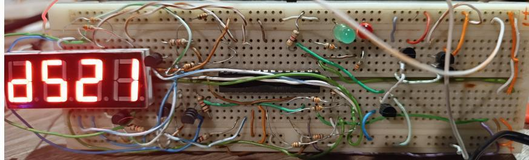
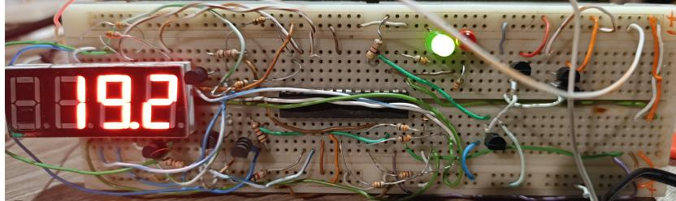
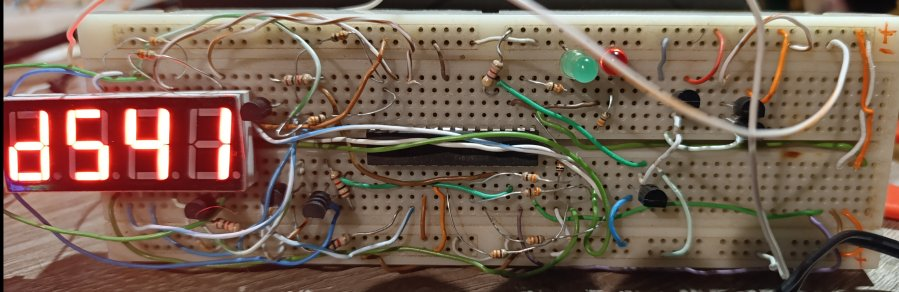
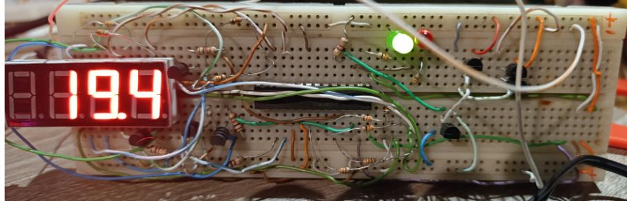
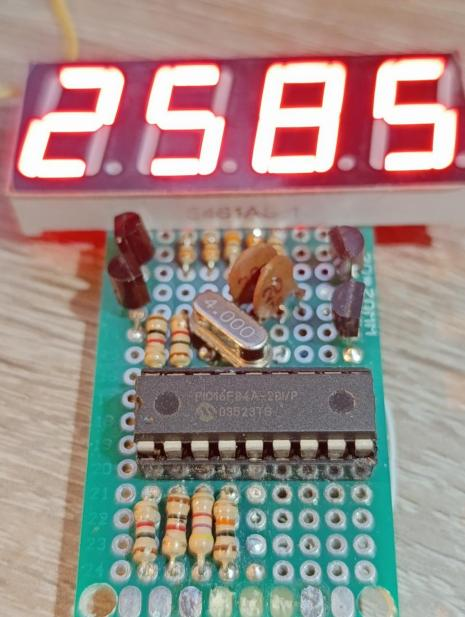

# PicThrowDK
Different projects for pic16f or pic18f microntrollers
It depends on PicLibDK repository 

<keep in mind that this is work in progress>

1. LED segments example - 
    
    for pic16f628a, also pic16f913 
    look to specific folders

2. DS18B20 usage with one ds18b20
    
    for pic16f913 with one or multiple sensors connected on same pin.
    
3. DS18B20 with cheap pic16f913
    System is capable of detecting id of each of the connected sensors
    and based on that communicate with them. Temperature is shown on the screen one after one sensors (second 1 is information abour normal or parasite power - 1 
    means normal)    
    Symbol shows that measurement of second connected sensor will be displayed
    
    And is displayed
    
    Symbol shows that measurement of 4th connected sensor will be displayed
    
    And is displayed
    

4. LED segments example in 16f84a - small, old pic16f - not very useful, but I like it very much (emotional connection)
    

