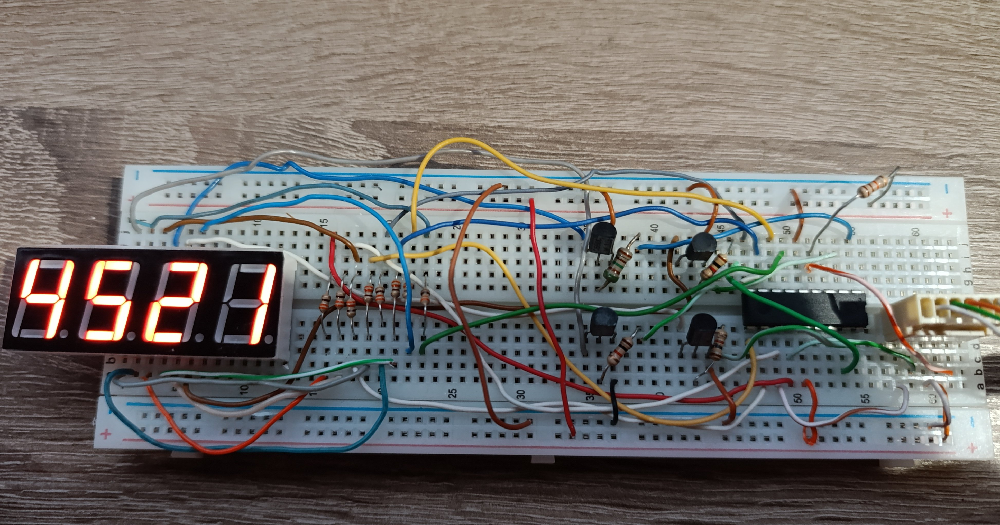
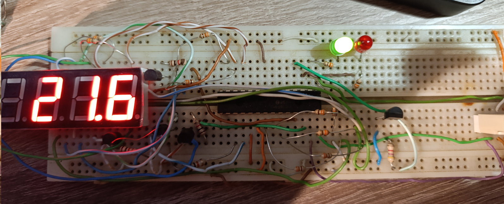

# PicThrowDK
Different projects for pic16f or pic18f microntrollers
It depends on PicLibDK repository 

<keep in mind that this is work in progress>

1. LED segments example - 
    
    for pic16f628a, also pic16f913 
    look to specific folders

2. DS18B20 usage 
    
    for pic16f913 so far (requires tmr2 for measurements)    

